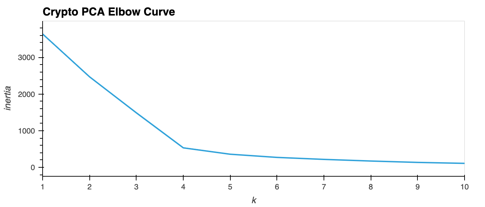
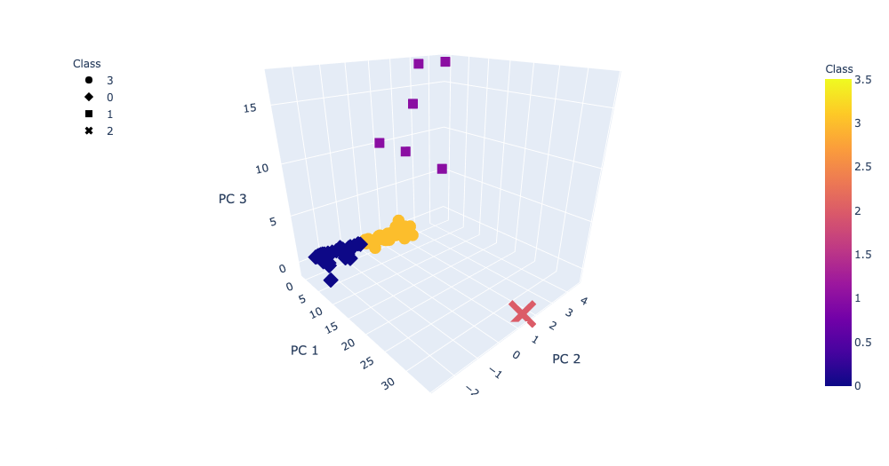
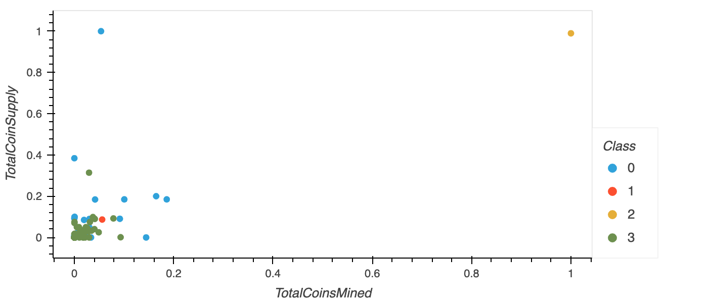

# Cryptocurrencies Analysis
Cryptocurrencies analysis with unsupervised machine learning

The focus of this project was to use unsupervised machine learning to examine cryptocurrency data. The following steps were taken:
* The data was first preprocessed by being cleaned, encoded, and scaled to more appropriately work with the algorithms.
* We then used Principle Component Analysis (PCA) to reduce the dimensions of the dataframe, for further analysis.
* The K-means algorithm was then used to create an elbow curve plot. This allowed us to find the best value for k, and thus the best number of clusters for the available data.

* Lastly we visualized the data. First we created a 3D scatter plot using the PCA data. Then we transformed data for "Total Coin Supply" and "Total Coins Mined", which we then used to create a 2D scatter plot.

